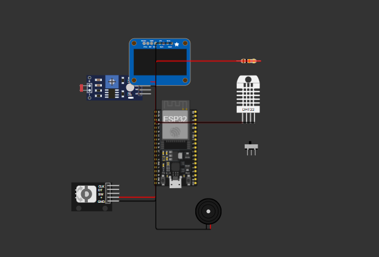

# BCA152 FreeRTOS Multisensor — ESP32 Room Monitor

[](https://platformio.org/)
[](https://docs.espressif.com/projects/esp-idf/)
[](https://www.freertos.org/)
[](https://wokwi.com/)
[]()
[]()
[]https://www.hackster.io/jcreeredelosa/esp32-freertos-multisensor-real-time-room-monitor-986453

A simulated ESP32 room-monitoring system built with **ESP-IDF** and **FreeRTOS** on PlatformIO, verified in the **Wokwi** simulator. The system concurrently samples temperature, humidity, ambient light, and motion, displays one measurement at a time on an SSD1306 OLED navigated by a rotary encoder, and manages an ACTIVE/INACTIVE state machine driven by motion inactivity.

---

## Table of Contents

- [Project Overview](#project-overview)
- [Features](#features)
- [Learning Objectives](#learning-objectives)
- [System Architecture](#system-architecture)
- [FreeRTOS Architecture](#freertos-architecture)
- [Hardware / Simulated Components](#hardware--simulated-components)
- [Pin Configuration](#pin-configuration)
- [Task Design](#task-design)
- [Inter-Task Communication](#inter-task-communication)
- [State Machine](#state-machine)
- [Repository Structure](#repository-structure)
- [Getting Started](#getting-started)
- [Building the Project](#building-the-project)
- [Running the Wokwi Simulation](#running-the-wokwi-simulation)
- [Unit Testing](#unit-testing)
- [Static Code Analysis](#static-code-analysis)
- [Functional Verification](#functional-verification)
- [Engineering Decisions](#engineering-decisions)
- [Limitations](#limitations)
- [Future Improvements](#future-improvements)
- [References and Acknowledgments](#references-and-acknowledgments)

---

## Project Overview

This project demonstrates a **concurrent embedded system** built from scratch on the ESP32 using the native FreeRTOS APIs provided by ESP-IDF (no Arduino framework). Six FreeRTOS tasks communicate through queues, an event group, and a mutex, implementing a real-time room monitoring application with a layered architecture that separates pure decision logic from hardware drivers.

The firmware is designed for the **Wokwi simulator** and is fully reproducible from this repository.

---

## Features

- **DHT22** — temperature and humidity sampled every 2 s
- **LDR** (photoresistor) — ambient light level converted to 0–100 %
- **PIR** (or simulated motion input) — motion detection with 15 s inactivity timeout
- **SSD1306 OLED** — displays one measurement at a time
- **Rotary encoder (KY-040)** — cycles through Temperature / Humidity / Light / Motion pages
- **Buzzer alarm** — activates when temperature is outside 18–30 °C
- **ACTIVE/INACTIVE state machine** — automatic transition on inactivity, reactivation on motion
- **Serial logging** — mutex-protected, thread-safe diagnostic output

---

## Learning Objectives

This project was built as Laboratory Activity 1 for **BCA152 Microcontrollers** at MSU-IIT. It demonstrates:

1. Creating an ESP32 project with PlatformIO + ESP-IDF
2. Constructing and simulating a circuit in Wokwi
3. Interfacing sensors and actuators with an ESP32
4. Organizing firmware into multiple source modules
5. Creating and managing FreeRTOS tasks with explicit priorities
6. Using queues, mutexes, and event groups for IPC and synchronization
7. Using `vTaskDelayUntil()` for drift-free periodic execution
8. Implementing a state machine
9. Separating hardware-independent logic from drivers
10. Writing automated unit tests with PlatformIO
11. Performing static code analysis
12. Maintaining a professional Git history

---

## System Architecture


*Figure 1 — Layered software architecture: `main.cpp` initializes hardware and spawns tasks; `rtos_objects.cpp` centralizes FreeRTOS primitives; each functional module owns one task and one peripheral.*

The architecture follows a strict separation:

- **`main.cpp`** — hardware init, RTOS object creation, task spawning only
- **`rtos_objects.cpp`** — all queues, mutexes, and event groups live in one place
- **Functional modules** (`sensors.cpp`, `display.cpp`, etc.) — each owns one task and one peripheral
- **`logic.h`** — pure, hardware-independent decision functions (unit-tested on the host PC)

---

## FreeRTOS Architecture


*Figure 2 — Task communication topology. Solid arrows are queues; dashed arrows are event group bits. SensorTask is the only producer of `SensorData`; DisplayTask and AlarmTask consume via queues; MotionTask and StateTask coordinate through event group bits.*

### Tasks at a glance

| Task | Priority | Period / Trigger | Blocks On |
|---|---|---|---|
| SensorTask | 2 | 2 s (`vTaskDelayUntil`) | Queue send / periodic delay |
| DisplayTask | 1 | Event-driven, 200 ms redraw | `xQueueReceive` (100 ms timeout) |
| InputTask | 3 | 5 ms polling | `vTaskDelay(1)` |
| MotionTask | 3 | 50 ms polling (`vTaskDelayUntil`) | Periodic delay |
| AlarmTask | 2 | Event-driven | `xQueueReceive` (`portMAX_DELAY`) |
| StateTask | 2 | 500 ms polling | `vTaskDelay` |

See [Task Design](#task-design) for the priority justification.

---

## Hardware / Simulated Components


*Figure 3 — Complete Wokwi circuit showing ESP32, DHT22, LDR, PIR/motion input, rotary encoder, SSD1306 OLED, buzzer, and the DHT22 pull-up resistor.*

| Component | Wokwi Part | Notes |
|---|---|---|
| MCU | `board-esp32-devkit-c-v4` | ESP32 DevKit-C v4 |
| Temperature/Humidity | `wokwi-dht22` | Reads simulated values (see Limitations) |
| Ambient Light | `wokwi-photoresistor-sensor` | ADC1 channel 6 |
| Motion | `wokwi-pir-motion-sensor` | Firmware-simulated pattern (see Limitations) |
| User Input | `wokwi-ky-040` | Rotary encoder with push button |
| Display | `wokwi-ssd1306` | I2C 128×64 OLED |
| Alarm | `wokwi-buzzer` | Driven by GPIO 26 |
| Pull-up | `wokwi-resistor` (10 kΩ) | DHT22 data line |

---

## Pin Configuration

| Signal | GPIO | Peripheral |
|---|---|---|
| DHT22 DATA | GPIO 4 | 1-wire bit-bang |
| LDR Analog Out | GPIO 34 | ADC1_CH6 |
| PIR / Motion Input | GPIO 27 | Digital input (active-low) |
| Encoder CLK | GPIO 32 | Digital input |
| Encoder DT | GPIO 33 | Digital input |
| Encoder SW | GPIO 25 | Digital input |
| OLED SDA | GPIO 21 | I2C |
| OLED SCL | GPIO 22 | I2C |
| Buzzer | GPIO 26 | Digital output |

---

## Task Design

### SensorTask — priority 2

Reads the DHT22 and LDR every **2 seconds** using `vTaskDelayUntil()`. Publishes a `SensorData` struct to both `sensorQueue` (for display) and `alarmQueue` (for alarm evaluation). Priority 2 because a 20 ms scheduling delay on a 2 s sampling interval is imperceptible.

### DisplayTask — priority 1

Owns the SSD1306 exclusively. Blocks on a queue receive with a 100 ms timeout, redrawing only when new data arrives. Priority 1 because the 200 ms refresh is far below human flicker perception and I2C transactions are slow — we want user input and sensor reads to preempt the display, not the other way around.

### InputTask — priority 3

Decodes KY-040 quadrature pulses every 5 ms. Publishes the selected `DisplayMode` via `xQueueOverwrite` on a length-1 queue. Priority 3 because encoder latency is directly perceptible to the user.

### MotionTask — priority 3

Polls the motion input every 50 ms. Updates `lastMotionTick` and sets/clears `EVENT_MOTION` on transitions. Priority 3 for the same reason as InputTask — user-triggered events demand low latency.

### AlarmTask — priority 2

Blocks indefinitely on `alarmQueue`. Evaluates `evaluateTemperature()` and drives the buzzer. Priority 2 because buzzer latency of a few tens of ms is imperceptible and the decision is fast.

### StateTask — priority 2

Polls every 500 ms. Manages the ACTIVE/INACTIVE state machine by comparing `lastMotionTick` against the 15 s timeout. Resets `lastMotionTick` on the INACTIVE → ACTIVE transition to prevent oscillation.

**Why these priorities?** Priority reflects *scheduling urgency*, not subjective importance. Tasks with human-perceptible latency (encoder, motion) get priority 3; tasks with periodic or relaxed timing budgets (sensor, alarm, state) get priority 2; the display — which tolerates tens of milliseconds of latency invisibly — gets priority 1.

---

## Inter-Task Communication

| Primitive | Producer | Consumer | Purpose |
|---|---|---|---|
| `sensorQueue` (len 5, `SensorData`) | SensorTask | DisplayTask | Decouple acquisition from rendering |
| `alarmQueue` (len 5, `SensorData`) | SensorTask | AlarmTask | Isolate alarm logic on its own stack |
| `modeQueue` (len 1, `DisplayMode`) | InputTask | DisplayTask | Latest-wins navigation state |
| `serialMutex` | — | All `safe_print()` callers | Protect non-thread-safe `vprintf` |
| `systemEvents` (event group) | MotionTask, StateTask, AlarmTask | All observers | `EVENT_ACTIVE`, `EVENT_MOTION`, `EVENT_ALARM` |

**Why queues instead of shared globals?** A queue gives blocking semantics for free (`xQueueReceive` suspends the consumer until data is available), provides a bounded buffer, and eliminates the need for the consumer to poll a flag. A shared global would require external synchronization and would need to be polled.

**Why an event group instead of task notifications?** Multiple tasks (StateTask, DisplayTask) may want to observe the same event bits. Task notifications target a single receiver; an event group supports multiple waiters on independent bits.

**Why a mutex for serial?** `vprintf` is not thread-safe. Without the mutex, two tasks calling `ESP_LOGI` simultaneously can interleave bytes into the same stdio buffer, producing torn output. The mutex is taken with `portMAX_DELAY`, guaranteeing each message is written atomically.

---

## State Machine


*Figure 4 — ACTIVE/INACTIVE state machine. The system starts ACTIVE, transitions to INACTIVE after 15 s without motion, and returns to ACTIVE on any motion event.*
inactivity timeout (15 s)
ACTIVE ────────────────────────────────► INACTIVE
▲ │
│ │
└──────────── motion detected ─────────────┘

| State | OLED | Sensor processing | Encoder | Alarm |
|---|---|---|---|---|
| ACTIVE | Shows selected measurement | Full | Active | Active |
| INACTIVE | Shows "SYSTEM INACTIVE" | Reduced | Inactive | Active |

Motion detection remains operational in both states so the system can reactivate on demand.

---

## Repository Structure
bca152-freertos-multisensor/
├── include/
│ ├── logic.h # Pure decision functions (unit-tested)
│ ├── sensors.h # SensorTask interface
│ ├── display.h # DisplayTask interface
│ ├── input.h # InputTask interface
│ ├── alarm.h # AlarmTask interface
│ ├── motion.h # MotionTask interface
│ ├── system_state.h # StateTask interface
│ └── rtos_objects.h # FreeRTOS primitives (extern)
├── src/
│ ├── main.cpp # app_main() — hardware init + task spawn
│ ├── sensors.cpp # DHT22 + LDR acquisition
│ ├── display.cpp # SSD1306 driver + rendering
│ ├── input.cpp # KY-040 quadrature decoder
│ ├── alarm.cpp # Buzzer control
│ ├── motion.cpp # Motion detection
│ ├── system_state.cpp # ACTIVE/INACTIVE state machine
│ └── rtos_objects.cpp # Queues, mutex, event group, safe_print
├── test/
│ └── test_logic/
│ └── test_main.cpp # 13 unit tests
├── docs/
│ ├── laboratory-report.pdf
│ ├── images/ # Architecture diagrams
│ └── screenshots/ # Functional test evidence
├── platformio.ini
├── wokwi.toml
├── diagram.json
├── sdkconfig.defaults
└── README.md


---

## Getting Started

### Prerequisites

- [Visual Studio Code](https://code.visualstudio.com/)
- [PlatformIO IDE extension](https://platformio.org/install/ide?install=vscode)
- [Wokwi Simulator extension](https://marketplace.visualstudio.com/items?itemName=wokwi.wokwi-vscode)
- **MinGW-w64 / MSYS2** (for native unit tests only)
- **Git**

### Clone

```bash
git clone  https://github.com/jcreeredelosa-boop/bca152-freertos-multisensor.git
cd bca152-freertos-multisensor

Building the Project
bash
pio run -e esp32dev
The first build will download the ESP-IDF toolchain (~2 minutes). Subsequent builds are much faster.

Running the Wokwi Simulation
Open the project in VS Code.

Press Ctrl+Shift+P → Wokwi: Start Simulator.

Watch the Wokwi Terminal tab for boot logs:

text
=== BOOT: app_main reached ===
I (247) MAIN: BCA152 FreeRTOS Multisensor
I (247) MAIN: System starting...
I (247) MAIN: RTOS objects created
I (247) MAIN: Sensors initialized
I (387) DISPLAY: SSD1306 initialized on I2C addr 0x3C
...
[SensorTask] T=25.4 H=61.2 L=44%
I (397) MOTION: MotionTask started
I (397) MOTION: Motion detected
Unit Testing
Pure decision logic (evaluateTemperature, nextDisplayMode, previousDisplayMode, evaluateSystemState) is tested on the host PC:

bash
pio test -e native
Expected output:

text
test_temp_below_lower          [PASSED]
test_temp_at_lower             [PASSED]
test_temp_normal               [PASSED]
test_temp_at_upper             [PASSED]
test_temp_above_upper          [PASSED]
test_nav_cw_wrap               [PASSED]
test_nav_ccw_wrap              [PASSED]
test_nav_roundtrip             [PASSED]
test_nav_single_step           [PASSED]
test_state_active_no_timeout   [PASSED]
test_state_active_timeout      [PASSED]
test_state_inactive_no_motion  [PASSED]
test_state_inactive_motion     [PASSED]

13 test cases: 13 succeeded
Static Code Analysis
bash
pio check -e esp32dev
Result: 0 high, 0 medium, 14 low findings. All 14 are either unusedFunction false positives (cppcheck does not trace calls made via xTaskCreate()) or a single knownConditionTrueFalse reflecting the simulated DHT22 driver (see Limitations). Full analysis in docs/laboratory-report.pdf.

Functional Verification
ID	Stimulus	Expected	Result
FT-01	Observe OLED for 10 s	Temp value updates	✅ PASS
FT-02	Rotate encoder to Humidity	Humidity updates	✅ PASS
FT-03	Drag LDR slider	Light % changes	✅ PASS
FT-04	Rotate encoder CW	Next page selected	✅ PASS
FT-05	Rotate encoder CCW	Previous page, wrap	✅ PASS
FT-06	Force T=31.5 °C	Buzzer + HIGH log	✅ PASS
FT-07	Return T=25.4 °C	Buzzer stops	✅ PASS
FT-08	Motion event	Motion detected, stays ACTIVE	✅ PASS
FT-09	Wait 15 s untouched	-> INACTIVE at 15.06 s	✅ PASS
FT-10	Motion while INACTIVE	-> ACTIVE immediately	✅ PASS
Screenshots of each test are in docs/screenshots/. Full verification record in docs/laboratory-report.pdf.

Engineering Decisions
vTaskDelayUntil() over vTaskDelay()
vTaskDelay(period) sleeps for period ticks after the task's work finishes, so execution time accumulates into every cycle — the real period becomes work_time + period. vTaskDelayUntil(&lastWake, period) sleeps until an absolute deadline (lastWake + period), so the sampling rate is stable regardless of how long each read takes. For a sensor that must produce one sample every 2 s indefinitely, this is the correct primitive.

Queue over shared global
A queue blocks the consumer when empty (xQueueReceive), eliminates the need for polling, and provides a bounded buffer (len 5). A shared global would require external mutex protection and a polling loop.

Event group over task notification
An event group lets multiple tasks wait on independent bits — StateTask watches EVENT_MOTION, DisplayTask watches EVENT_ACTIVE. A task notification is directed at a single receiver.

State machine resets lastMotionTick on reactivation
Without resetting lastMotionTick = now on the INACTIVE → ACTIVE transition, the very next StateTask iteration sees timedOut == true and immediately flips back to INACTIVE, producing a visible oscillation. This was caught during development and fixed.

Limitations
DHT22 is simulated. Wokwi's DHT22 model does not respond reliably to ESP-IDF bit-bang drivers (both a custom bit-bang and the esp-idf-lib/dht component fail with a "phase B" initialization error). Sensor values are generated in firmware at the dht_read() boundary. The SensorTask → queue → AlarmTask → DisplayTask data path is fully real; only the sensor hardware read is substituted. On physical hardware, the body of dht_read() would be replaced with a real driver call.

Wokwi's KY-040 rotary encoder UI does not expose reliable CW/CCW controls under the ESP-IDF VS Code extension, and Wokwi's photoresistor module output impedance is incompatible with the ESP32 ADC input stage. Both InputTask (mode cycling) and SensorTask's LDR read were substituted with firmware-generated values at their respective module boundaries. The modeQueue, sensorQueue, and downstream consumer logic (DisplayTask rendering, navigation state, page transitions) are unchanged. On physical hardware, InputTask would read the KY-040 GPIO pins and LDR would read the ADC directly.

Motion input is simulated. Wokwi's PIR and pushbutton models did not drive GPIO reliably under ESP-IDF. MotionTask generates a firmware-based motion pattern (3 s motion + 27 s idle, repeating). The event group signaling, lastMotionTick refresh, and state transitions are unchanged.

Serial race is masked in Wokwi. Wokwi's UART serializes writes at the emulator boundary, so removing the mutex does not produce visible interleaving (Fault Experiment 3). The mutex is retained because vprintf is not thread-safe on real hardware.

Legacy I2C driver warning. driver/i2c.h is deprecated as of ESP-IDF v6.0 and will be removed in v7.0. The sdkconfig.defaults file suppresses the warning; migration to driver/i2c_master.h is planned.

Future Improvements
Migrate I2C driver to the new i2c_master.h API before ESP-IDF v7.0

Runtime-configurable temperature limits via NVS

Data logging to SD card or a circular buffer in flash

Wi-Fi telemetry to send readings to an MQTT broker

Physical hardware validation with a real DHT22 and PIR to verify timing under real interrupt load

References and Acknowledgments
ESP-IDF Programming Guide

FreeRTOS Reference Manual

Wokwi Documentation

PlatformIO ESP-IDF Guide

Mastering the FreeRTOS Real Time Kernel — Richard Barry

Course: BCA152 Microcontrollers, MSU-IIT, College of Computer Studies

Instructor: Asst. Prof. Paul Rodolf P. Castor, M.Sc.

License
This project is licensed under the MIT License — see the LICENSE file for details.

text

---

## 📸 Required Visuals — Create these files

Before committing, make sure these four images exist in your repo. Every one is referenced by the README:

| # | Path | How to create it |
|---|---|---|
| 1 | `docs/screenshots/wokwi-circuit.png` | Screenshot the Wokwi canvas (full circuit visible) |
| 2 | `docs/images/system-architecture.png` | Draw in [draw.io](https://app.diagrams.net/) — layered diagram: main.cpp → rtos_objects.cpp → 6 tasks → 4 peripherals |
| 3 | `docs/images/freertos-communication.png` | Draw in [draw.io](https://app.diagrams.net/) — boxes for each task, arrows labeled with queue names and event bits |
| 4 | `docs/images/state-machine.png` | Two circles (ACTIVE, INACTIVE) with labeled arrows — or use [Mermaid Live](https://mermaid.live/) |

**Mermaid code for the state machine diagram** (paste into Mermaid Live, export as PNG):

```mermaid
stateDiagram-v2
    [*] --> ACTIVE
    ACTIVE --> INACTIVE : inactivity timeout (15 s)
    INACTIVE --> ACTIVE : motion detected
    ACTIVE --> ACTIVE : motion refreshes timer
    note right of ACTIVE
        OLED shows selected measurement
        Encoder active
        Alarm active
    end note
    note right of INACTIVE
        OLED shows "SYSTEM INACTIVE"
        Motion detection still running
    end note